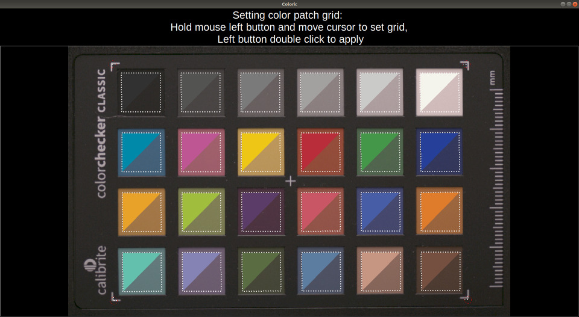

# `spectraprofiler`

`spectraprofiler` application implements a workflow to create DNG color profiles (DCP), that can be used together with [MRTech IFF SDK](https://mr-te.ch/iff-sdk).
It shares most of the C++ code with [`imagebroker`](https://github.com/mr-technologies/imagebroker) example IFF SDK application, but also includes `coloric.py` Python script for visual color target grid positioning and uses [dcamprof](https://torger.se/anders/dcamprof.html) and [Argyll CMS](https://www.argyllcms.com/) for DCP file generation.
Application is located in `samples/04_color` directory of IFF SDK package.
It comes with example configuration files (`spectraprofiler.json` and `res/coloric.json`) suited for XIMEA cameras and standard 24-patch color reference target (e.g. Calibrite ColorChecker Passport Photo 2).
See `linux` and `windows` directories for helper scripts to install required dependencies (e.g. [OpenCV](https://opencv.org/) library).
Operation is controlled using a keyboard:

* `1` decreases exposure
* `2` increases exposure
* `Tab` captures an image and starts the profile generation procedure (further instructions are shown on the screen)
